# Classification-Using-Logistic-Regression

The objective of the dataset is to diagnostically predict whether or not a patient has diabetes, based on certain diagnostic measurements included in the dataset.All patients here are females at least 21 years old of Pima Indian heritage.Predictor variables includes the number of pregnancies the patient has had, their BMI, insulin level, age, and so on.

Here, I used **Logistic Regression** for solving this clasification problem and measured its various performance attributes on the given dataset.

## RESULT
Following performance attributres were observed on the dataset by Logistic Regression:
```
Accuracy:  0.8181818181818182
Precision: 0.7567567567567568
Recall:    0.5957446808510638
```


>(1) denotes the positive class (presence of something like malignant cancer cell, diabetes,etc)

>(0) denotes the negative class and absence of things above. 

Here, we have only two classes(0/1). In multiclass problems, we have multiple classes like y=0,1,2,3, etc .

### Problems with using Linear Regression for Classification 
Let's say we want to classify cancer cell as malignant or benign using Linear Regression.

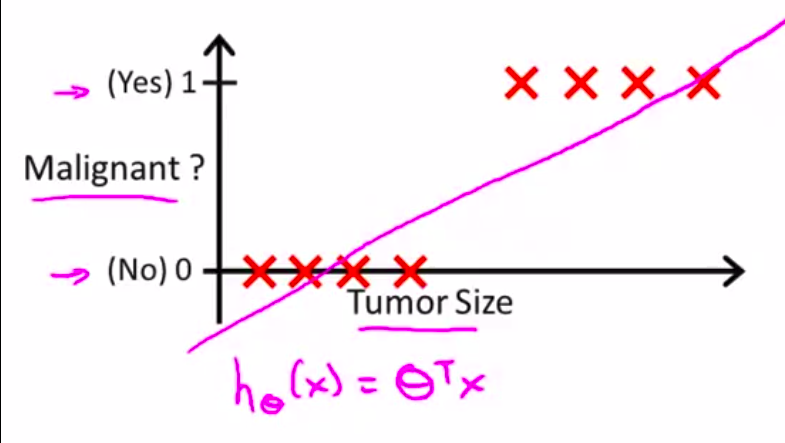

what we can do is **set a threshold value for classification**:
<p float="left">
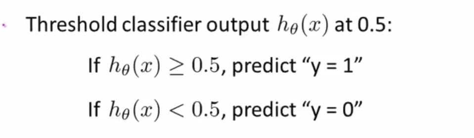
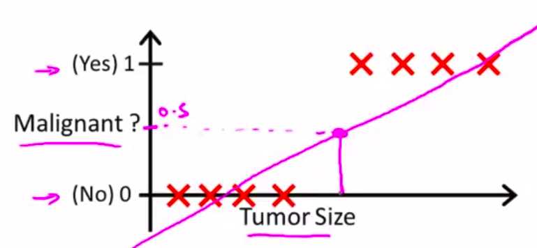
     </p>
  
But, if there comes a new training example to the far right(_the blue arrow_), the hypothesis function will change giving(_blue line_):

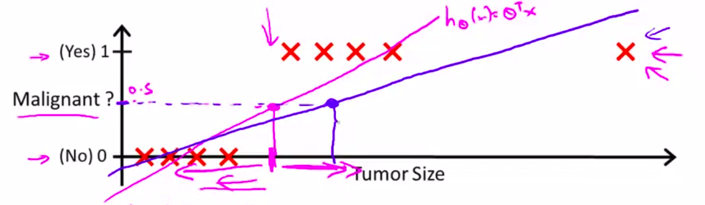

So, if we have the same threshold of 0.5, this will lead to a lot of wrong predictions.

There is also an **another strange thing**(and doesn't make sense) when using Linear Regression for classification problems:

For binary classification we know that y is either zero or one. But if you are using linear regression, the hypothesis can output values that are much larger than one or less than zero, even if all of your training examples have labels y equals zero or one. 

***So we use Logistic Regression Algorithm for Classification***

## LOGISTIC REGRESSION
Logistic regression is a generalized linear model (GLM). We would like our classifier to output values that are between 0 and 1. So we modify the hypothesis function from linear regression as follows:

<p float="left">
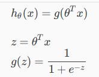

 <p>

g(z) is called the **Sigmoid/Logistic Function**. 

And As z goes to minus infinity, g(z) approaches zero. And as g(z) approaches infinity, g(z) approaches one. And so because g(z) upwards values are between zero and one, we also have that h(x) must be between 0 and 1.

### Interpretation of Hypothesis Output
Here, ***h(x) gives the estimated probability that y=1 on input x ***

Example, we have a single feature x_1= Tumor Size and by convention x_0 is taken as 1.
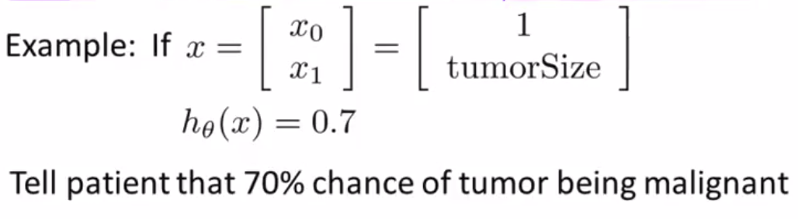

So,
  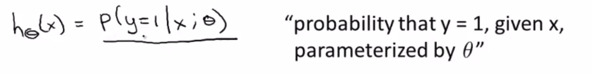
  
>***logistic regression is a regression algorithm and it does predict a continuous outcome: the probability of an event. The fact that we use it as a binary classifier is due to the interpretation of the outcome.***

### Decioson Boundary
The decision boundary is the line that separates the area where y = 0 and where y = 1. It is created by our hypothesis function.

In order to get our discrete 0 or 1 classification, we can translate the output of the hypothesis function as follows:

  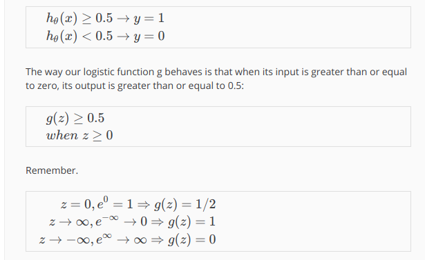
  
  >***Whenever the hypothesis outputs that the probability of y being one is greater than or equal to 0.5, so this means that if there is more likely to be y equals 1 than y equals 0, then let's predict y equals 1.***
  
  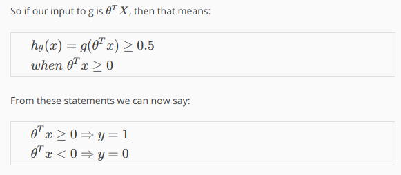
  
  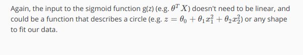

Example,

  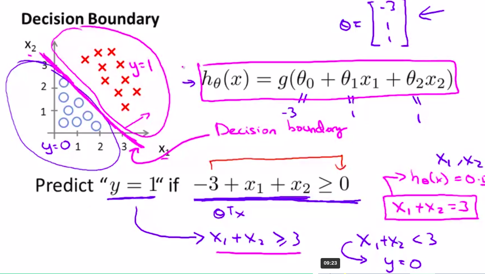
  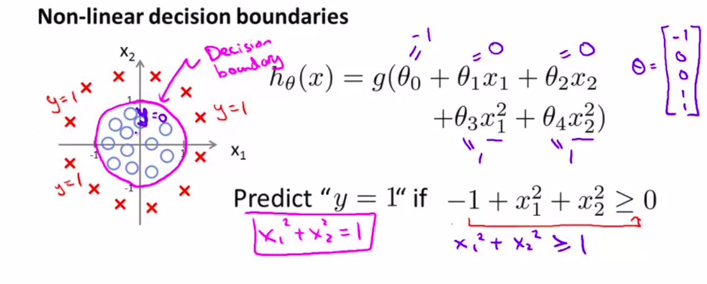

### COST FUNCTION


